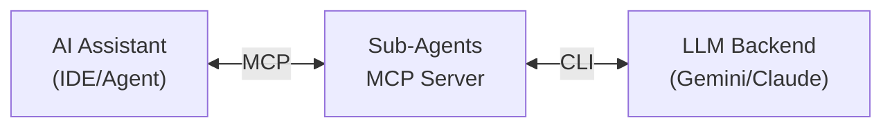

# Sub-Agents MCP Server

一个基于 [Model Context Protocol (MCP)](https://modelcontextprotocol.io/) 的 AI 子代理服务，为各类`AI编程IDE`和`Cli工具`提供专业化的代理能力扩展。

## 📖 项目简介

Sub-Agents 允许你的 AI 助手调用专门的 Gemini 子代理来执行特定任务：

- **Reviewer** - 代码审查专家，检测 Bug、逻辑漏洞、安全风险
- **Explorer** - 代码结构分析师，理解代码架构、追踪逻辑流程
- **Doc Keeper** - 外部知识管理员，获取和整理外部文档



## 🚀 快速开始

### 前置依赖

1. **Python 3.10+**
2. **Gemini CLI** - 请参考 [Gemini CLI 官方安装指南](https://github.com/google-gemini/gemini-cli) 进行安装

3. **依赖安装**
   ```bash
   pip install -r requirements.txt
   ```

### 配置

1. 复制示例配置文件：
   ```bash
   cp mcp_config.example.json mcp_config.json
   cp .env.example .env
   ```

2. 编辑 `mcp_config.json`，配置 Python 路径和项目路径（参见下方示例）

---

## ⚙️ MCP 配置示例

Sub-Agents 支持两种传输模式：**STDIO** 和 **SSE (HTTP)**。不同的 IDE 对这两种模式的支持程度不同。

### 模式 1: STDIO 模式（推荐）

STDIO 模式通过标准输入输出进行通信，配置简单，适用于大多数场景。

```json
{
    "mcpServers": {
        "sub-agents": {
            "command": "D:/your/project/.venv/Scripts/python.exe",
            "args": [
                "D:/your/project/subAgent/src/server.py"
            ],
            "env": {
                "SUB_AGENT_CWD": "D:/your/working/directory",
                "USE_PREVIEW_MODELS": "true",
                "GEMINI_TIMEOUT": "360"
            }
        }
    }
}
```

### 模式 2: SSE 模式 (HTTP)

SSE 模式通过 HTTP 进行通信，支持更复杂的场景（如远程部署、多客户端）。

**步骤 1**: 先启动 HTTP 服务器
```bash
python src/server.py --transport http --host 127.0.0.1 --port 8000
```

**步骤 2**: 在 IDE 中配置 MCP 客户端
```json
{
    "mcpServers": {
        "sub-agents": {
            "url": "http://127.0.0.1:8000/sse",
            "headers": {
                "X-Sub-Agent-Config": "{\"SUB_AGENT_CWD\": \"D:/your/working/directory\", \"USE_PREVIEW_MODELS\": \"true\", \"GEMINI_TIMEOUT\": \"360\"}"
            }
        }
    }
}
```

> ⚠️ **注意**: SSE 模式下，配置信息通过 HTTP Header 传递，需要将 JSON 转义为字符串。

---

## 🔧 IDE 兼容性与已知问题

### Antigravity (Google)

| 模式 | 支持状态 | 说明 |
|------|---------|------|
| STDIO | ✅ 完全支持 | 推荐使用 |
| SSE | ❌ 不支持 | 当前版本不支持 HTTP 传输 |

**已知问题**:
- ❌ **Windows stdout 污染**: Antigravity 的 STDIO 模式对输出格式要求严格。本项目已内置静默日志配置，避免任何非协议输出。
- ❌ **Windows CR/LF 问题**: Windsurf 在 Windows 上可能发送包含 `\r\n` 的消息，导致 JSON 解析失败。本项目已内置 `BinaryCRStripper` 修复此问题。

### Trae
| 模式 | 支持状态 | 说明 |
|------|---------|------|
| STDIO | ✅ 完全支持 | 推荐使用 |
| SSE | ✅ 支持 | 推荐使用 |

---

## 📁 项目结构

```
subAgent/
├── src/
│   ├── __init__.py      # 包初始化
│   ├── server.py        # MCP 服务器入口
│   ├── router.py        # Agent 路由器
│   ├── config.py        # 配置加载器（单例）
│   ├── launcher.py      # Gemini CLI 启动器
│   └── model_resolver.py # 模型别名解析
├── prompts/
│   ├── reviewer.md      # Reviewer Agent 提示词
│   ├── explorer.md      # Explorer Agent 提示词
│   └── doc_keeper.md    # Doc Keeper Agent 提示词
├── tools/
│   ├── doc_mcp.py       # Doc Keeper 专用 MCP 工具
│   └── gen_header_config.py  # SSE Header 配置生成器
├── agents.yaml          # Agent 配置文件
├── mcp_config.example.json  # MCP 配置示例
└── requirements.txt     # Python 依赖
```

---

## 🔑 环境变量
| 变量名 | 说明 | 默认值 |
|--------|------|--------|
| `SUB_AGENT_CWD` | 子代理工作目录 | 必须指定 |
| `GEMINI_EXECUTABLE` | Gemini CLI 可执行文件路径 | 自动查找 |
| `USE_PREVIEW_MODELS` | 是否使用预览模型 | `true` |
| `GEMINI_MODEL_ALIAS_AUTO` | 自动模型别名 | `auto` |
| `GEMINI_MODEL_ALIAS_PRO` | 专业模型别名 | `pro` |
| `GEMINI_MODEL_ALIAS_FLASH` | 闪存模型别名 | `flash` |
| `GEMINI_MODEL_ALIAS_FLASH_LITE` | 闪存轻量模型别名 | `flash-lite` |
| `GEMINI_TIMEOUT` | CLI 超时时间（秒） | `180` |

---

## 📝 使用示例

配置完成后，你可以在 AI 助手中这样使用：

```
请调用 reviewer 检查 src/router.py 中的潜在问题
```

```
请调用 explorer 帮我理解 ConfigLoader 的单例实现
```

```
请调用 doc_keeper 整理 PyTorch DataLoader 的官方文档要点
```

---

## 🛠️ 开发

### 本地调试
```bash
# STDIO 模式
python src/server.py

# HTTP 模式
python src/server.py --transport http --port 8000
```

---

## 📄 License

MIT License
